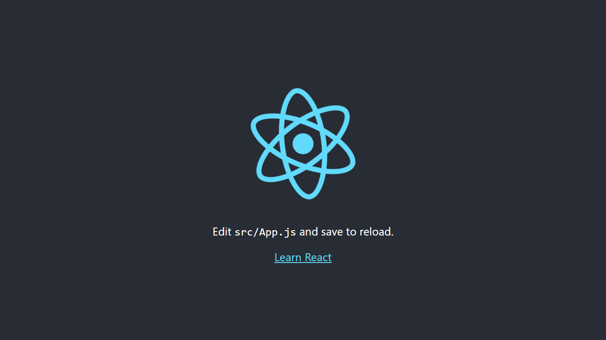
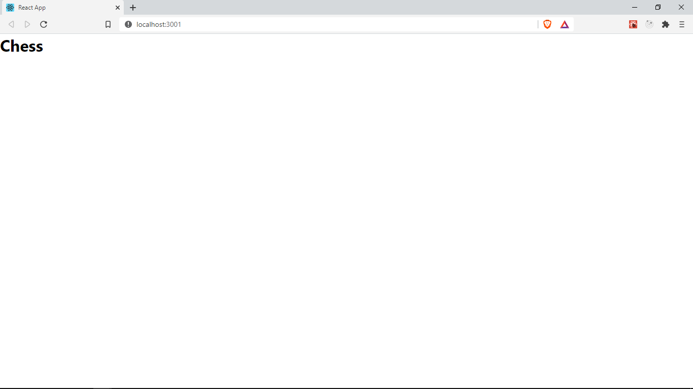

To get started, lets create a new React project by running

```
npx create-react-app chess-client
```

This creates a new app with React and installs the dependencies. Run `cd chess-client` to navigate to that folder and run `npm start` to start the application.
`npx` and `npm` commands were installed as part of your installation of Node.js



Delete all the files in `src` folder of your project. Don't worry, we will be creating them from scratch

Create a new file `App.js` in the `src` folder we just cleared. This is our application's entry point.
In `App.js` let's create a new React component by adding the following code.

```java
// src/App.js

import React from 'react';
import './App.css';

function App() {
	return <h1>Chess</h1>;
}

export default App;
```

This a React functional component. It is a regular JavaScript function that returns some HTML tags, This special HTML in JS syntax is known as JSX (JavaScript XML). We have to import React to use JSX.
Since we are importing `App.css`
Let's create a new file `App.css` in `src` to add some base styling

```css
/* src/App.css */

* {
	margin: 0;
	padding: 0;
}
body {
	font-family: -apple-system, BlinkMacSystemFont, 'Segoe UI', 'Roboto',
		'Oxygen', 'Ubuntu', 'Cantarell', 'Fira Sans', 'Droid Sans',
		'Helvetica Neue', sans-serif;
}
```

Let's use this component to view some content on our browser

Create a new file `index.js` in the `src` folder and add the following code

```java
// src/index.js

import React from 'react';
import ReactDOM from 'react-dom';
import './index.css';
import App from './App';

ReactDOM.render(
	<React.StrictMode>
		<App />
	</React.StrictMode>,
	document.getElementById('root')
);
```

We use ReactDOM, a package installed with React. It helps us render React elements to the browser DOM.
We call `ReactDOM.render()` passing our `App` component as the first argument and a HTMl element returned from `document.getElementById('root')` as the second. If you inspect the `index.html` file in `public`, you will find an empty, `<div id="root"/>`. This is where `ReactDOM` renders our `App` component.

Our component is wrapped in `React.StrictMode`, this is optional but gives us useful warnings about any possible issues in our components.

Notice how we use our component as `<App/>`. React components are used like HTML tags, and they must start with an uppercase letter.

Save and check your browser, the App should now look as shown


