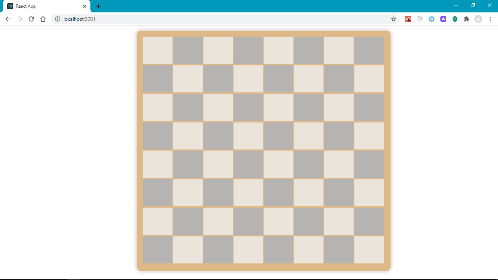
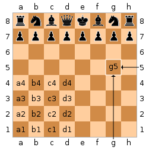

## Working with our data

Next we will be creating a chess board.

A chessboard consists of 64 equal squares arranged in eight rows and eight columns.

Here is a sample of what we will have:



In order to get started, let's install [chess.js](https://github.com/jhlywa/chess.js)

In your project root directory, run

```java
npm install chess.js
```

Create a folder in `src`called `pages`, our App will consist of several pages. Create a new folder `Game` and a new file inside `Game`, name it `index.jsx`. This will be the entry point to the page. (_jsx_ is a valid file name extension for JavaScript React)

```
src
├───pages
├───App.js
├───App.css
└───index.js
```

```
pages
    └───Game
        └───index.jsx
```

Inside `src/pages/Game/index.jsx` we will be creating a component that will be main game controller. It will render the board and hold our game's data(state)

Let's create a new component `Game` by adding the following code.

```java title="src/pages/Game/index.jsx"
import React, { useState, useRef } from 'react';
import Chess from 'Chess.js';

const FEN = 'rnbqkbnr/pppppppp/8/8/8/8/PPPPPPPP/RNBQKBNR w KQkq - 0 1';
const Game = () => {
	const [fen, setFen] = useState(FEN);
	const { current: chess } = useRef(new Chess(fen));

	return <div></div>;
};

export default Game;
```

## Getting started with Hooks

First, we import the `useState` hook. A Hook is a function that allows us to use features from React's API. They typically start with the _use_ prefix. `useState` helps us create stateful values. These are values that can be updated to re-render our component. `useState` takes an initial value and returns an array of 2 elements which we can [destructure](https://developer.mozilla.org/en-US/docs/Web/JavaScript/Reference/Operators/Destructuring_assignment) out, the first item is the stateful value, and the second is a function we can use to update this value. We will use this in a while.

We can pass an initial value to `useState`, which in this case is the `FEN` variable.

Destructuring is a syntax that allows us to get elements from an array. It can also be applied to an object to get it's properties. Here is a snippet showing how it works

```java title="Destructuring"
// * Array destructuring.
const fruits = ['orange', 'apples', 'berries' ];
const [one, two, three] = fruits; //we destructure items based on their respective index
// one = 'orange'
// two = 'apples'
// three = 'berries'

//* Object destructuring
const person = {name: 'Nel', address: 'South 7' };
const {name, address} = person; //we can destructure properties from an object
// name = 'Nel'
// address = 'South 7'
```

## FEN

[FEN (Forsyth–Edwards Notation)](https://en.wikipedia.org/wiki/Forsyth%E2%80%93Edwards_Notation) is a string notation used to describe a particular board position of a chess game. The FEN value we used above `rnbqkbnr/pppppppp/8/8/8/8/PPPPPPPP/RNBQKBNR w KQkq - 0 1`, describes the starting position of any chess game.

It has 6 fields seperated by a space. For this tutorial, we will only work with the first field. `rnbqkbnr/pppppppp/8/8/8/8/PPPPPPPP/RNBQKBNR` This field tells us the position of all the pieces in the game at the beginning.
It's okay if you are not familiar with chess, let's break it down: each character in that string represents a piece `r -> rook`, `n -> (k)night`, `b -> bishop`, `q -> Queen`, `k-> King`. The uppercase characters represent white pieces, while the lowercase represent black.
You don't need to know how these pieces play in order to follow along, just knowing what the characters represents should be enough.

Next, the `/` seperates the rows.

The numbers represents _that_ number of empty cells, e.g `/8` represents 8 empty cells that make up that row.

## useRef hook

Next, we create a new Chess instance, passing to it our `fen` and then save it inside of the `useRef` hook. `useRef` helps us store mutable non-stateful values that persist across render cycles. Let's make that a bit more clear, our components will re-render whenever we update state values in order to reflect this changes in the browser, we can store variables in `useRef` to prevent their values from being lost whenever the component re-renders. `useRef` returns an object with a property called `current` that holds our value. We destructure off that `current` property and rename it to `chess`, this will hold our `chess` object.

Next, let's convert our `fen` into a data structure that is more expressive and easier to work with, which we can reference as our board. For example, we can have an array of objects where each object contains a property for it's position and the piece it holds.

## Creating our board data

To do this, let's create a new folder inside `src` called `functions`, This will hold some utility functions for the game. Create a new file in functions `create-board.js`.

We need to write a function that takes in a **FEN** string and returns a _board_. The _boad_ will be an array of _Cells_. Each cell will be an object with a `position` property (where it is on the board) and a `piece` property (the piece it holds).

```java
const board = [
	{ pos: 'a1', piece: 'r' },
	{ pos: 'a2', piece: 'n' },
	{ pos: 'a3', piece: 'b' },
	//...
];
```

The position of a cell(square) in a chess board is identified using a [standard algebraic notation](<https://en.wikipedia.org/wiki/Algebraic_notation_(chess)>), which is derived from its column and row.
The board has 8 columns labelled from _a-h_ and 8 rows labelled from _1-8_. For example, a cell located in the fifth column second row has a position of `e2`



Let's create the function in steps to add the board generation logic.

We start off by defining a Cell `Class` and the `createBoard` function. This function takes in a **FEN** string and returns an array of `Cells`, which will be the board.

A `Cell` object will have a position, e.g `a1` and the piece it holds, e.g `K` for white King.

Above the `createBoard` function, we have a helper function `range`. It takes an integer, `n` and returns an array of items between _1-n_. It will be useful in creating the board.

```java title="/src/functions/create-board.js"
class Cell {
	constructor(pos, piece) {
		this.pos = pos;
		this.piece = piece;
	}
}

//  returns an array of range 1, n
const range = (n) => {
	return Array.from({ length: n }, (_, i) => i + 1);
};
export const createBoard = () => {

}
```

```java title="/src/functions/create-board.js"
// The rest of the code in this file has been left out to keep this short
export const createBoard = (fenString) => {

	const fen = fenString.split(' ')[0]; //Get the first portion

	const fenPieces = fen.split('/').join(''); //remove the row delimiters '/'
	//rnbqkbnrpppppppp8888PPPPPPPPRNBQKBNR
}
```

Inside `createBoard`, we use `fenString.split(' ')[0]` to get the first portion of the string, which is what we need. Next we apply `fen.split('/').join('')` to convert the FEN into one long continuous string `rnbqkbnrpppppppp8888PPPPPPPPRNBQKBNR`

```js title="/src/functions/create-board.js"
// still inside createBoard function

let pieces = Array.from(fenPieces);
//Save individual pieces for each of the 64 cells
Array.from(fenPieces).forEach((item, index) => {
	if (isFinite(item)) {
		pieces.splice(index, 1, range(item).fill(''));
	}
});
pieces = pieces.flat();
```

After getting our continous **FEN**, we change it into an array in order to parse it further. Remember, the **FEN** gives us the piece in each position. However, it is highly summarized. For example, an empty row of 8 cells is abbreviated as 8, similarly, any empty empty adjacent cells are represented by a number `n` where `n` is the number of the empty cells. So to make it easier to work with, let's parse the **FEN** such that any empty cell is represented by an empty string. This way, we will get a total of 64 pieces for each of the 64 cells. That's what the code section above is doing.
We are looping through the `fenPieces` and replacing each number `n` we find with an array of `n` empty strings by making use of the `range()` function we had defined earlier.
Finally, we appy `.flat()` to extract items from the nested array we introduced.
Eventually, we have an array with 64 items where each item is a string that represents a chess piece e.g `K` or an empty string if that particular cell is empty.

Read more about this array methods we have used [Array.from](https://developer.mozilla.org/en-US/docs/Web/JavaScript/Reference/Global_Objects/Array/from), [forEach](https://developer.mozilla.org/en-US/docs/Web/JavaScript/Reference/Global_Objects/Array/forEach), [flat](https://developer.mozilla.org/en-US/docs/Web/JavaScript/Reference/Global_Objects/Array/flat), [splice](https://developer.mozilla.org/en-US/docs/Web/JavaScript/Reference/Global_Objects/Array/splice), [fill](https://developer.mozilla.org/en-US/docs/Web/JavaScript/Reference/Global_Objects/Array/fill)

```java title="/src/functions/create-board.js"
const rows = range(8)
	.map((n) => n.toString())
	.reverse(); //["8", "7", "6", "5", "4", "3", "2", "1"]

const columns = ['a', 'b', 'c', 'd', 'e', 'f', 'g', 'h'];

const cells = []; //[a1, b1, c1..., h8]
for (let i = 0; i < rows.length; i++) {
	const row = rows[i];
	for (let j = 0; j < columns.length; j++) {
		const col = columns[j];
		cells.push(col + row); //e.g a1, b1, c1...
	}
}
```

Next, we create an array of cells from the `rows` and `columns`. This does not contain final the `Cell` objects, it only holds the positions for the cells, i.e a1-h8, but it will help us create the final `Cell` objects. We reverse the `rows` to loop from 8 to 1. This helps us generate the cells in the order they would visually appear in the browser i.e `a8 - h8` at the top of the board and `a1-h1` at the bottom of the board.

```java title="/src/functions/create-board.js"
const board = [];
for (let i = 0; i < cells.length; i++) {
	//'cells', and 'pieces' have the same length of 64
	const cell = cells[i];
	const piece = pieces[i];
	board.push(new Cell(cell, piece));
}

return board;
```

Finally, we loop through the `cells` and `pieces` arrays. In each iteration we create a new `Cell` object with a position i.e `cell[i]` and piece `pieces[i]; ` and add it to the board array.

Open the browser developer tools using `Ctrl + Shift + i` and try running each of the code snippets provided above to see what they output.

Eventually, this function returns the `board` array.
Next, we will use this `board` data to create a component that will display the items in our `board` array.

You can find the completed code for this lesson [here](https://github.com/franknmungai/live-chess/tree/02-create-the-chess-board-data)

:::tip
Copy entire source code for create-board.js from the next section.
