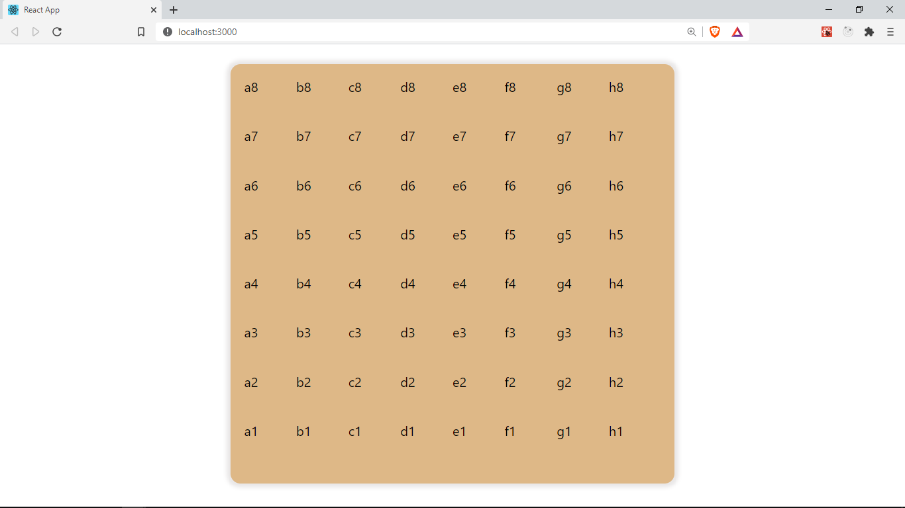

## Working with our data

<!-- Next we will be creating a chess board. It will look something like this -->

<!--  -->

In order to get started, let's install [chess.js](https://github.com/jhlywa/chess.js)

In your project root directory, run

```java
npm install chess.js
```

Create a folder `pages`, our App will consist of several pages. Create a new folder `Game` and a new file with `Game`, name it `index.jsx`. This will be the entry point to the page

<!-- Folder structure -->

Inside `/pages/Game/index.jsx` we will be creating a component that will be main game controller. It will render the board and hold our game's data(state)

Let's add create a new component `Game` and add some game data.

```java
import React, { useState, useRef } from 'react';
import Chess from 'Chess.js';

const FEN = 'rnbqkbnr/pppppppp/8/8/8/8/PPPPPPPP/RNBQKBNR w KQkq - 0 1';
const Game = () => {
	const [fen, setFen] = useState(FEN);
	const { current: chess } = useRef(new Chess(fen));

	return <div></div>;
};

export default Game;
```

We import the `useState` hook. A Hook is a function that allows us to use features from React's API, they typically start with the _use_ prefix. `useState` helps us create stateful values. This are values that can be updated to re-render our component. `useState` takes an initial value and returns an array of 2 items which we can [destructure](https://developer.mozilla.org/en-US/docs/Web/JavaScript/Reference/Operators/Destructuring_assignment) out, the first item is the stateful value, and the second is a function we can use to update this value. We will use this in a while
We pass an initial value to `useState`, which is the `FEN` variable.

[FEN (Forsyth–Edwards Notation)](https://en.wikipedia.org/wiki/Forsyth%E2%80%93Edwards_Notation) is a string notation used to describe a particular board position of a chess game. The FEN value we used above `rnbqkbnr/pppppppp/8/8/8/8/PPPPPPPP/RNBQKBNR w KQkq - 0 1`, describes the starting position of any chess game.

It has 6 fields seperated by a space. For this tutorial, we will only work with the first field. `rnbqkbnr/pppppppp/8/8/8/8/PPPPPPPP/RNBQKBNR` This field tells us the position of all the pieces in the game at the beginning.
It's okay if you are not familiar with chess, let's break it down: each character in that string represents a piece `r -> rook, n -> (k)night, b -> bishop, q -> Queen, k-> King`. The uppercase characters represent black pieces, while the lowercase represent white.
You don't need to know how these pieces play in order to follow along, just knowing what the characters represents should be enough.

Next, the `/` seperates the rows. The numbers represents that number of empty cells, e.g `/8` represents 8 empty cells that make up that row.

Next, we create a new Chess instance, passing to it our `fen` and then save it inside of the `useRef` hook. `useRef` helps us store mutable non-stateful values that persist across render cycles. Let's make that a bit more clear, our components will render whenever we update state values in order to reflect this changes in the browser, we can store variables in `useRef` to prevent their values from being lost whenever the component re-renders. `useRef` returns an object with a property called `current` that holds our values. We destructure off that `current` property and rename it to `chess`, this will hold our `chess` object.

Next, let's convert our `fen` into a data structure that is more expressive and easier to work with, which we can reference as our board. For example, we can have an array of objects where each object contains a property for it's position and the piece it holds.

```java
const board = [
	{ pos: 'a1', piece: 'r' },
	{ pos: 'a2', piece: 'n' },
	{ pos: 'a3', piece: 'b' },
	//...
];
```

To do this, let's create a new folder inside `src` called `functions`, This will hold some utility functions for the game. Create a new file in functions `index.js`.

We need to write a function that takes in a **FEN** string and returns a _board_ (an array with the structure shown above)
