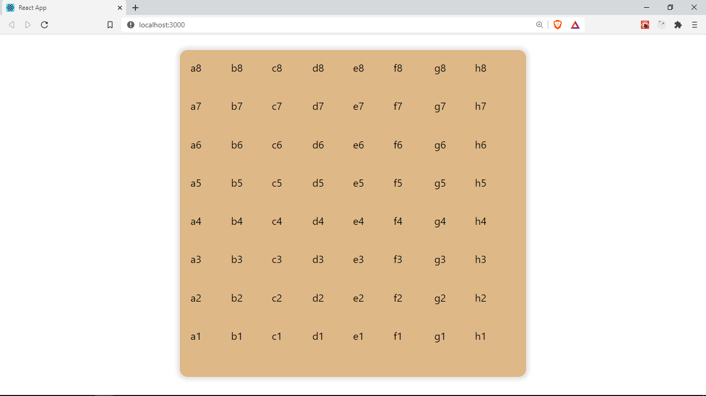

Let's use the `createBoard` function we wrote in the previous section to create the Chess board component.

First, inside the `functions` folder (`/src/functions`), let's create a file `index.js` and add the folloing code to export all the utility functions from our various files in `functions`.

```java
// src/functions/index.js
export * from './create-board';
```

This will make importing this utlity function easier as we will only need to reference `./functions`

Next, inside our `Game` component in `/src/Pages/Game/index.jsx`, let's import and use our `createBoard` function.

```java
// src/Pages/Game/index.jsx

import React, { useState, useRef, useEffect } from 'react';
import Chess from 'chess.js';
import { createBoard } from '../../functions';
import Board from '../../components/board';

const FEN = 'rnbqkbnr/pppppppp/8/8/8/8/PPPPPPPP/RNBQKBNR w KQkq - 0 1';
const Game = () => {
	const [fen, setFen] = useState(FEN);
	const { current: chess } = useRef(new Chess(fen));
	const [board, setBoard] = useState(createBoard(fen));

	useEffect(() => {
		setBoard(createBoard(fen));
	}, [fen]);

	return (
		<div className="game">
			<Board cells={board} />
		</div>
	);
};

export default Game;
```

Notice we added another `useState` hook, and set it's initial value to the value returned from calling `createBoard(fen)`, which is our board data. We also get `board` which is what we will use in our component and `setBoard` to update the board.

## useEffect

We also imported the `useEffect` hook. `useEffect` by default runs once the component is mounted i.e is placed is the DOM for the first time, it also runs on every subsequent re-renders(component updates) e.g when the state is updated, or when its _props_ values have changed (We will be discussing _props_ soon).

We pass a callback function to `useEffect` which is exceuted everytime it runs.
Here is an example signature for `useEffect`

```java
useEffect(() => {
   //this is called when the component is mounted for the first time and when any re-renders happen
})
```

We can provide an array of dependencies as the second argument to `useEffect` as we did in the `Game` component. This ensures that `useEffect` only runs on first mount or when any of the items in the dependencies array changes. We can also provide an empty array of dependencies which ensures that `useEffect` only runs on first mount.

In our case, we provided an array of dependencies which only contains `fen`. `useEffect` will therefore run when the value of `fen` changes. We will be constantly updating the `fen` as the users moves their pieces, and when the `fen` changes, we update our board by calling `setBoard()` and providing the updated value of the `fen` inside of `useEffect`

You can read more about `useEffect` in the React [docs](https://reactjs.org/docs/hooks-effect.html). We will be using it very often in this game, and you will get more comfortable with it as the game progress.

## `useEffect` in summary

```java
useEffect(() => {
    //runs when the component is mounted for the first time and after every update
})
```

```java
useEffect(() => {
    //runs only on first mount
}, [])
```

```java

useEffect(() => {
    //runs on first mount and when either va1 and val2 changes
}, [val1, val2])
```

## props

As part of the return statement for this component, we have a component called` <Board />`. We are providing a special _attribute_ to this component. In React, this is called a _prop_, it is a value that is provided to a component. Components can receives props, just the same way functions can receive parameters. A value for a _prop_ can be any valid JavaScript data type. In this case, we are providing a prop whose name is _cells_ and it's value is the `board` which we have in state. We can provide _any_ name to _prop_ as long as it's a valid variable name.
_props_ are one way to share data between react components.

Let's create this board component. Inside of `src`, let's add a new folder called `components`. Here we will store our reusable react components. Inside `src/components`, let's add a new folder `Board` and a a new file inside `Board` called `index.jsx`. This is where we will define our component.

```java
// src/components/Board/index.jsx
import React from 'react';
import './board.styles.css';

const Board = ({ cells }) => {
	return (
		<div className="board">
			{cells.map((cell) => (
				<div key={cell.pos}>{cell.pos}</div>
			))}
		</div>
	);
};

export default Board;

```

In this component, we receive an object holding our _props_, from which we can destructure the _cells_, which was the name of the prop we are receiving from `Game`. It's value is our _board_ object, which is an array of `Cells` as seen earlier.

## Iterating over lists with `map`

As part of this component's return statement, we have `cells.map((cell) => <div>{cell.pos}</div>`.
Since since `cells` is an array, we are calling `.map` which is a method that transforms one array to another. It iterates over the `board` array and for each Cell, it creates a _div_ This creates an array of _divs_, we use the `{}` syntax to write expressions in _jsx_, as in `<div>{cell.pos}</div>`, to render the position of the cell as the child content in our `div`. We also wrap the `.map` expression in braces `{}`.

Notice we provide a `key` attribute to the _div_. Whenever we create elements/components dynamically for example using `.map() ` we need to provide a unique key so that React can manage this multiple elements.

Also notice how the top level `div` has a `className` attribute. In React, we pass classes using the `className` attribute instead of `class`. This is because class is a reserved JavaScript keyword.

Finally, let's create a new file inside the `Board` called `board.styles.css` and some styling to it

```css
.board {
	padding: 1rem;
	margin: 2 auto; /** centered */
	border-radius: 12px;
	box-shadow: 0 0 5px 5px #e9e7e7;
	width: calc(100vh * 0.9);
	height: calc(100vh * 0.85);
	display: grid;
	grid-template-columns: repeat(8, 1fr);
	background-color: burlywood;
}
```

We convert the board into a grid container by applying `display: grid`, next, we create 8 columns of equal size `grid-template-columns: repeat(8, 1fr)`. All our child elements, which is the list of cells are fit into this 8 columns, hence creating a 2-d grid of 8 rows and 8 columns.
Learn more about how CSS Grid works [here](https://www.w3schools.com/css/css_grid_container.asp)

```css
.board {
	display: grid;
	grid-template-columns: repeat(8, 1fr);
}
```

We are also using a special CSS function called `calc()` to set the width and the height of the board. It is used to calculate a value from an expression. It is very useful for calculating dimensions dynamically.

Let's use our `Game` component inside of `App.js`

```java
// src/App.js

import React from 'react';
import './App.css';
import Game from './pages/Game';

function App() {
	return <Game />;
}

export default App;
```

Here is what our app looks like now 🎉😃



You can find the code for this lesson [here](https://github.com/franknmungai/live-chess/tree/03-creating-the-board-components)

In the next section, we will be making the board more prettier by adding a `Cell` component and marking out light and dark cells
