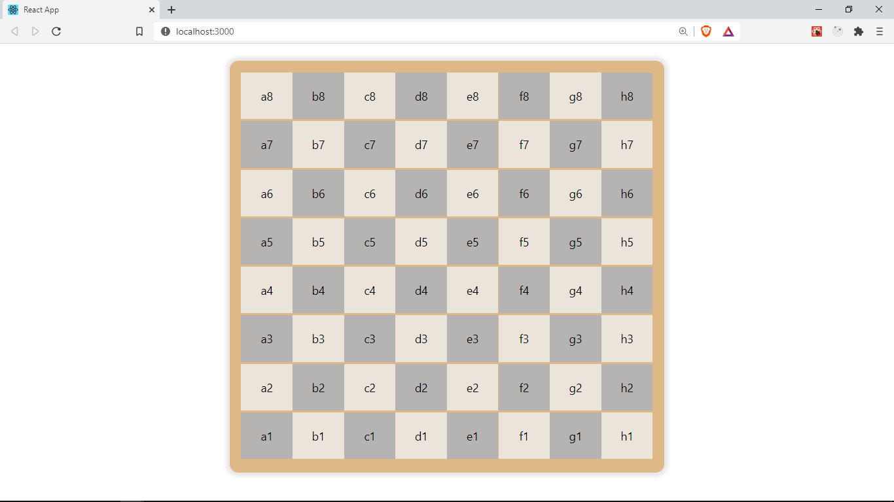

## Creating the `Cell` component

In the previous section, we worked on creating the board component. However it is not fully complete. The board needs distinct cells. This are the small squares that hold the pieces. As mentioned before, the board has 64 cells arranged in 8 rows and 8 columns. The cells are alternately colored light and dark. (You can read more about how a chess board is set up [here](https://docs.kde.org/trunk5/en/kdegames/knights/board.html), this is optional as we will be going through all this)


The cells are a crucial component of this game, they help us identify the position of each of the pieces and determine how the pieces can be moved.

In `src/components`, let's create a new folder named `cell` and create a new file
`index.jsx` in `/cell`, this will hold our cell component. Let's create another file inside `cell` and save it as `cell-styles.css`. It will contain the styling for this component.

```
components
    └───cell
        |───index.jsx
        └───cell-styles.css
```

Let's add the following code to the cell component in `components/cell/index.jsx`

```js title="/src/components/cell/index.jsx"
import React from 'react';
import './cell-styles.css';
import { isLightSquare } from '../../functions/';

const Cell = ({ cell, index }) => {
	const light = isLightSquare(cell.pos, index);

	return <div className={`cell ${light ? 'light' : 'dark'}`}>{cell.pos}</div>;
};

export default Cell;
```

We create a functional component called `Cell`. This component will receive some `props` (properties). Any properties passed to a component are always received as an object and hence can be destructured out. We receive `cell` and `index` as our `props`. The cell will be an instance of `Cell`, with the `pos` and `piece` properties. We also receive `index` as a second `prop`.
This is the index of the cell in the board array.
We will be using the `index` to determine whether a cell should be light or dark.

Inside our component, we are calling the `isLightSquare` function, which we import from `functions` and providing the cell's position and index as its arguments. This function determines whether a cell should be styled as light or dark based on this parameters. It returns `true` if a cell should be styled as a light square. We will be creating this function shortly

`Cell` returns a `div` with some text content passed as `cell.pos` to render the cell's position
e.g `a1`. We wrap this in braces `{}` as all expressions inside our _JSX_ markup should be.

## Dynamic classNames in JSX

Notice the className set to the `div` we are returning. It's an expression created with an ES6 template string (using backticks ` {``} ` ) , which helps us easily use expressions in strings. We provide `cell` as the first className, next we use a ternary expression to assign a second className of `light` or `dark` based on whether the `light` is true. To use expressions in template strings they have to be enclosed in `${}`

This shows how we can use template strings to provide dynamic classNames based on conditions.

## Styling

We already importing our stylesheet. Let's add some css in `cell/cell-styles.css` to style the component.

```css title="/src/components/cell/cell-styles.css"
.cell {
	text-align: center;
	padding: 0.25rem 0.35rem;
	display: flex;
	justify-content: center;
	align-items: center;
	width: calc((100vh * 0.9) / 9.5);
	height: calc((100vh * 0.85) / 9.5);
}

.light {
	background-color: rgb(235, 228, 219);
}
.dark {
	background-color: #b6b3b3;
}
```

For the `cell` class, we are using `display:flex` `justify-content: center` `align-items: center` to center the content in our Cell horizontally and vertically. For now, the content is a text containing the cell's postion but later on, the content will be a chess piece.
We are also using the css `calc` function to calculate width and height values that fit well in our board.

Next we define `light` and `dark` classes that set the background color.

## Defining isLightSquare function

Let's create the `isLightSquare` function we used earlier in our component that determines whether a square should be styled as light or dark. Having alternate dark and light squares is just for aesthetics and color doesn't make a cell special in any way.

Inside our `functions` folder, `src/functions`, let's create a new file and save it as `light-square.js`. Within this file let's define the `isLightSquare` function.

```java title="/src/functions/light-square.js"
/**
 * @param {string} position The position of the cell e.g a1
 * @param {number} index.
 * @returns {boolean} true if a square/cell should be labelled as light
  based on its index
 */
export const isLightSquare = (position, index) => {
	const row = position[1];
	const isEven = (x) => !(x % 2);

	if (isEven(row) && !isEven(index + 1)) {
		return true;
	}

	if (isEven(index + 1) && !isEven(row)) {
		return true;
	}
	return false;
};

```

It takes two arguments, the `position` of a cell and its `index`. Recall that the position of a cell consists of its column and row `a1`.
Next we create a helper function that determines if a number provided is _even_ by returning `true` and false if otherwise.

If you examine a chess board closely, you will notice that if the number of a row is _odd_, then all the cells in _even_ positions are light-colored and if a row is _even_, then all the cells in _odd_ positions are light-colored. This assumes that we count our cells from 1, 2 and so on, that's why we use `index + 1` as it is easier to count and determine this from 1 instead of 0.

Based on this observation, we write some conditional checks that return `true` from this


Finally let's export this from our `index.js` in functions by adding

```java title="/src/functions/index.js"
export * from './create-board';
export * from './light-square'; //add this line

```

With that, let's go to our `Board` component in `src/components/board/index.jsx` and make use of the `Cell` component we have created.

```java title="/src/components/board/index.jsx"
import React from 'react';
import './board.styles.css';
import Cell from '../cell';

const Board = ({ cells }) => {
	return (
		<div className="board">
			{cells.map((cell, index) => (
				<Cell cell={cell} index={index} key={cell.pos} />
			))}
		</div>
	);
};

export default Board;
```

We are looping through the `cells` array we receive as _props_ and creating a new `Cell` component from each item in that array. We are passing the `cell` and `index` as _props_ to Cell which are being used in this component. We also provide a unique _key_ attribute.

Finally this is what we have at the moment. A step closer 😊



You can find the code for this lesson [here](https://github.com/franknmungai/live-chess/tree/04-creating-the-cells)

In the next section, we will be adding a `Piece` component for the chess pieces in our _Cells_.
