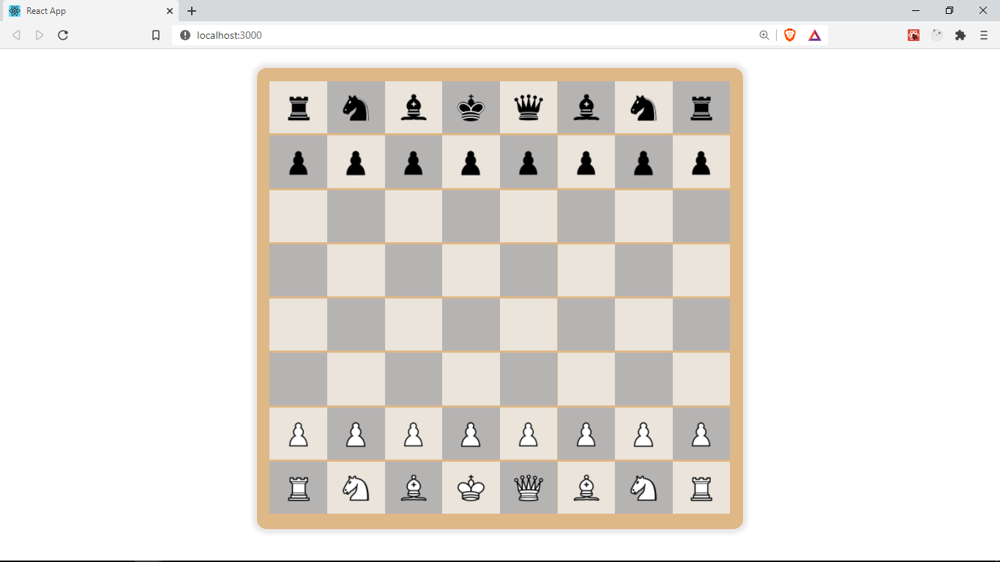

## Get the images

Let's add draggable chess pieces in our cells.

First we need some images for chess the pieces, in `src` let's add a new folder named `assets`. It will contain our app's assets such as images. Let's create a new folder in `assets` called `pieces`. This folder will hold the images of our chess pieces. Download all the assets used in this project from [here](../static/assets.rar)

## Creating the `Piece` component

Next, let's create a new folder inside `src/components` called `piece`. In `components/piece` let's add two files, `index.jsx` as the component's entry point and `piece-styles.css` as the css file for this component.

<!-- Todo Add better directory structure -->

Let's create a new component named `Piece` in `index.jsx` by adding the following lines

```java
import React from 'react';
import PropTypes from 'prop-types';
import './piece-styles.css';

const Piece = ({ name, pos }) => {
	const color = name === name.toUpperCase() ? 'b' : 'w';
	const imageName = color + name.toUpperCase();
	let image;

	try {
		image = require(`../../assets/pieces/${imageName}.png`);
	} catch (error) {
		image = require('../../assets/pieces/empty.png'); //an empty fallback image
	}

	return (
		
	);
};

Piece.prototype = {
	name: PropTypes.string.isRequired,
	pos: PropTypes.string.isRequired,
};
export default Piece;
```

## Loading images dynamically with `require`

The `Piece` component expects to receive two _properties/props_. A `name` and `pos` prop.
The `name` _prop_ will hold the name of the piece for example `K` for _king(black)_, recall that white pieces are uppercase and black pieces are lowercase. The `pos` _prop_ will be the name of the cell holding this piece for example `a1`.

In the next few lines we try to figure out which piece image to use based on the name and color of this piece. First you will notice that inside our `/src/assets/pieces` folder where we saved this piece images, the images have a consistent name pattern. Each image name comprises of the color(in lowercase) and the type of piece(in uppercase). For example `wP.png` and `bQ.png` for white _pawn_ and black _queen_ respectively.
(You can read more about various types of chess pieces [here](https://docs.kde.org/trunk5/en/kdegames/knights/piece-movement.html), though it's not required).

So first we use a ternary expression to derive the color of this piece based on whether it is name is uppercase or not. Next, we concatenate the `color` and the name of the piece `color + name.toUpperCase()`. this gives us the name of the image we need to import e.g `wB.png` for _white bishop_.

Next we try to load that image from our assets folder and the computed `imageName`. We use the `require` function. `require` is used to load JavaScript modules but it can also be used to load images, fonts, icons and other assets in React components. This all works due to [Webpack](https://webpack.js.org/), a package React uses behind the scenes to bundle all this dependencies into a single module. This also explains why we can `import` css files in React as though they were JavaScript bundles.

We use `require` in a `try catch` block to catch errors, since empty cells do not contain any `name(s)` to pass to their `Piece` components hence no image will be resolved, so in the catch block, we provide an empty fallback image.

Finally in our return statement, we have a _img_ and we set it's `src` attribute to the value of the image we loaded dynamically. We also set the HTML5 `draggable` attribute `true`. It will make this element draggable.

## PropTypes

At the bottom we include PropTypes for this components. PropTypes are used to specify the name and types for the props we expect for this component. We get helpful warnings when we have missing props that are required, or when we provide the wrong types for the props. [PropTypes](https://reactjs.org/docs/typechecking-with-proptypes.html) are also a great way of documenting components. We need to import Proptypes from `prop-types` in order to use them.

```java
Piece.prototype = {
	name: PropTypes.string.isRequired,
	pos: PropTypes.string.isRequired,
};
```

Let's add proptypes to our other components, `Cell` and `Board` as well. (PropTypes are optional).

In the Board component `/src/components/board/index.jsx`, we receive the `cells` prop which is an array so we add the following lines at the very bottom of the file. Remember to import `PropTypes`

```java
// /src/components/board/index.jsx

Board.prototype = {
	cells: PropTypes.array.isRequired,
};
```

In Cell component, we receive the `cell` prop which is an instance of the `Cell` _class_ in `create-board.js` so we add the following

```java
// /src/components/cell/index.jsx

import { isLightSquare, Cell as BoardCell } from '../../functions/';

Cell.prototype = {
	cell: PropTypes.instanceOf(BoardCell).isRequired,
	index: PropTypes.number.isRequired,
};
```

Notice that we needed to import the `Cell` class from the `functions/index.js` file. So let's make sure its exported inside of `create-board.js` where its defined.

```java
// src/functions/index.js
export class Cell {
	constructor(pos, piece) {
		this.pos = pos;
		this.piece = piece;
	}
}
```

We renamed the import to `BoardCell` to prevent a nameclash with our component.

Finally let's make use of the `Piece` component inside of our `Cell` component.

```java
import React from 'react';
import PropTypes from 'prop-types';
import './cell-styles.css';
import { isLightSquare, Cell as BoardCell } from '../../functions/';
import Piece from '../piece';

const Cell = ({ cell, index }) => {
	const light = isLightSquare(cell.pos, index);

	return (
		<div className={`cell ${light ? 'light' : 'dark'}`}>
			<Piece pos={cell.pos} name={cell.piece} />
		</div>
	);
};

Cell.prototype = {
	cell: PropTypes.instanceOf(BoardCell).isRequired,
	index: PropTypes.number.isRequired,
};
export default Cell;
```

We pass the `pos` and `name` props with their values as required

This is what our app looks like at the moment 😃



In the next section, we will be using drag and drop events to actually drag the pieces across the board to make moves.

Get the full code for this lesson [here](https://github.com/franknmungai/live-chess/tree/05-adding-draggable-pieces)
