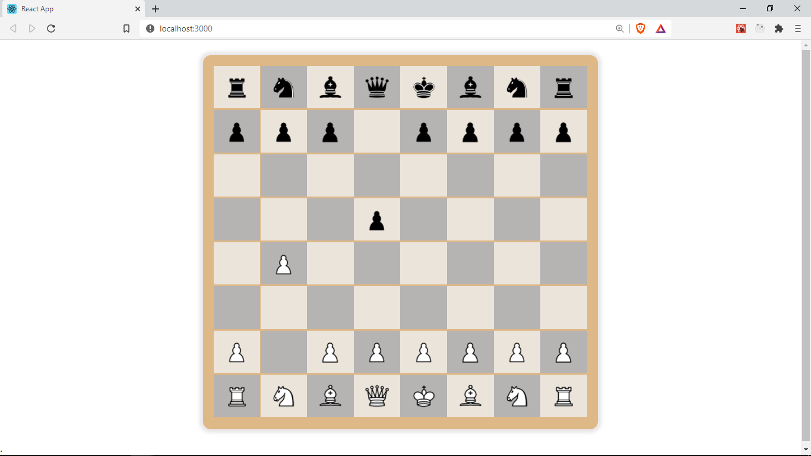

## Approach

Here is a brief overview of the approach and steps we will take to implement dragging and dropping pieces to make moves:

First need to store the original position/cell of a piece before it was dragged.

Next need to store the cell on which a piece is dropped.
The _chess.js_ library we are using offers the `chess.move()` method we can use to move pieces.

Once we move a piece using `chess.move()`, _chess.js_ updates the _FEN_ string we provided and we can then use `chess.fen()` to get the newly updated _FEN_ (board position) after the move.

Then we can update our `fen` which is in our Game component state with the new _FEN_ value. This will automatically update the board and pieces to show the changes/moves.

## ref objects

In the `Game` component inside `src/pages/Game/index.jsx`, let's create a new _ref_ object using the`useRef` hook called `fromPos`. This will store the original position of a cell before it was dragged. We use a ref since `useRef` values are not reset/lost incase the component re-renders. It's good for holding persisting values in a component.

```java {15-25}
// src/pages/Game/index.jsx

import React, { useState, useRef, useEffect } from 'react';
import Chess from 'chess.js';
import { createBoard } from '../../functions';
import Board from '../../components/board';

const FEN = 'rnbqkbnr/pppppppp/8/8/8/8/PPPPPPPP/RNBQKBNR w KQkq - 0 1';
const Game = () => {
	const [fen, setFen] = useState(FEN);
	const { current: chess } = useRef(new Chess(fen));
	const [board, setBoard] = useState(createBoard(fen));
	useEffect(() => {
		setBoard(createBoard(fen));
	}, [fen]);

	const fromPos = useRef();

	const makeMove = (pos) => {
		const from = fromPos.current;
		const to = pos;
		chess.move({ from, to });
		setFen(chess.fen());
	};

	const setFromPos = (pos) => (fromPos.current = pos);

	return (
		<div className="game">
			<Board cells={board} makeMove={makeMove} setFromPos={setFromPos} />
		</div>
	);
};

export default Game;
```

## Making the move

We also defined a `makeMove` function that takes in the position/cell we want to move to as it's parameter. We get the original position `from` by access the `current` property from our `ref` object. We then call the `chess.move({ from, to })` method providing the `from` and `to` properties needed to make a move.
`setFen()` is the function returned from `useState` which can be used to update the `fen` value. `chess.fen()` returns the updated `fen` value after making this move. We then update our _fen_ value in state with the latest _fen_ from our chess object by calling
`setFen(chess.fen())`. This will cause our component to be re-rendered/updated.

```java
	useEffect(() => {
		setBoard(createBoard(fen));
	}, [fen]);
```

Notice how we make use of `useEffect` to call `setBoard` which updates our board state whenever the _fen_ changes.

:::info
We cannot update a state value by direct reassignement or mutation, e.g `fen = chess.fen()` or `board=createBoard(fen)` this would not work.
We have to use the state updater function whenever we need to update any state values. Like `setBoard` or `setFen`, and pass the new value for the state to that function.
:::

We also have a second function `setFromPos` that takes in the original position of a piece before it's dragged and stores it in our `ref` object `(fromPos.current = pos)`

Next, we pass down this this two functions as _props_ to the `Board` component since they need to be shared with the `Cell` and `Piece` components where we will handling the drag and drop events.

We need to receive this _props_ in the `Board` component and pass them to `Cell` and also update our proptypes

```java {{7}, {17-21}, {5}}
//src/components/board/index.jsx
import React from 'react';
import PropTypes from 'prop-types';
import './board.styles.css';
import Cell from '../cell';

const Board = ({ cells, ...props }) => {
	return (
		<div className="board">
			{cells.map((cell, index) => (
				<Cell cell={cell} index={index} key={cell.pos} {...props} />
			))}
		</div>
	);
};

Board.prototype = {
	cells: PropTypes.array.isRequired,
	makeMove: PropTypes.func,
	setFromPos: PropTypes.func,
};
export default Board;
```

We can use the JavaScript [rest](https://codeburst.io/a-simple-guide-to-destructuring-and-es6-spread-operator-e02212af5831) operator to hold all other props inside a `props` variable.
`{ cells, ...props }`. We also use the [spread](https://codeburst.io/a-simple-guide-to-destructuring-and-es6-spread-operator-e02212af5831) operator to pass this props to the `Cell` component without having to access them directly.

## `onDrop` and `onDragOver`

In the `Cell` component, we need to receive this _props_ and make use of them

```java {19-20}
// src/components/piece/index.jsx
import React from 'react';
import PropTypes from 'prop-types';
import './cell-styles.css';
import { isLightSquare, Cell as BoardCell } from '../../functions/';
import Piece from '../piece';

const Cell = ({ cell, index, makeMove, setFromPos }) => {
	const light = isLightSquare(cell.pos, index);

	const handleDrop = () => {
		makeMove(cell.pos);
	};

	return (
		<div
			className={`cell ${light ? 'light' : 'dark'}`}
			onDrop={handleDrop}
			onDragOver={(e) => e.preventDefault()}
		>
			<Piece pos={cell.pos} name={cell.piece} setFromPos={setFromPos} />
		</div>
	);
};

Cell.prototype = {
	cell: PropTypes.instanceOf(BoardCell).isRequired,
	index: PropTypes.number.isRequired,
    makeMove: PropTypes.func,
	setFromPos: PropTypes.func,
};
export default Cell;
```

In `Cell` we specify an `onDrop` handler function called `handleDrop`. This is how we attach event handlers to specific DOM events in React.
The `handleDrop` function calls `makeMove` which receive as a _prop_ and passes this cell's position to it. This function is the one responsible for making the moves.

We also provide an inline function to the `onDragOver` event. This is necessary to allow our Cell components to be _draggedOver_

Finally we pass the `setFromPos` function as a _prop_ to the Piece component.

## `onDragStart` and `onDragEnd`

In `Piece` we make the following changes

```java {37-39}
// src/components/piece/index.jsx

import React, { useRef } from 'react';
import PropTypes from 'prop-types';

import './piece-styles.css';

const Piece = ({ name, pos, setFromPos }) => {
	const color = name === name.toUpperCase() ? 'w' : 'b';
	const imageName = color + name.toUpperCase();
	const element = useRef();

	let image;

	try {
		image = require(`../../assets/pieces/${imageName}.png`);
	} catch (error) {
		image = '';
	}

	const handleDragStart = () => {
		setFromPos(pos);
		setTimeout(() => {
			element.current.style.display = 'none';
		}, 0);
	};
	const handleDragEnd = () => {
		element.current.style.display = 'block';
	};

	return (
		<div
			className="piece"
			style={{
				background: `url(${image}) center center/cover`,
			}}
			draggable={true}
			ref={element}
			onDragStart={handleDragStart}
			onDragEnd={handleDragEnd}
		/>
	);
};

Piece.prototype = {
	name: PropTypes.string.isRequired,
	pos: PropTypes.string.isRequired,
	setFromPos: PropTypes.func.isRequired,
};
export default Piece;
```

First, we add a _ref_ attribute to this div and provide the `element` as the ref, which we created from `useRef`. `const element = useRef()`. This helps use access this _div_ through `element.current`. This is a another use case of the `useRef` hook, it can help us access DOM elements.

Next, we provide the `handleDragStart` function to handle the `onDragStart` event. In the `handleDragStart` function, we call the `setFromPos` function which receive as a prop and pass to it the our current cell position. We also use a `setTimeout` function to hide this element to prevent it from appearing in its original postion while it's being dragged.

Finally, provide an `onDragEnd` handler function that makes this element visible once it's dropped.

Have you noticed the pattern here? We are using functions we receive as _props_ to pass data to our `Game` component where the move is actually taking place. We are passing some data to the parent components through function parameters. You can generally pass data to higher level components through function parameters like we did here. (Data flow in React still remains [unidirectional](https://reactjs.org/docs/thinking-in-react.html))

Finally this is what our game looks like.



White is usually the first to make a move, so drag any white pawn  one or two squares forward to make a valid move, then try the same for black.

Chess.js already handles the validation for the moves so any invalid chess move will not work and the piece retains its original place.

In the next section, we will be improving the user experience of our game by highlighting a user's possible moves.

Find the source code for this lesson [here](https://github.com/franknmungai/live-chess/tree/06-drag-n-drop-events)
