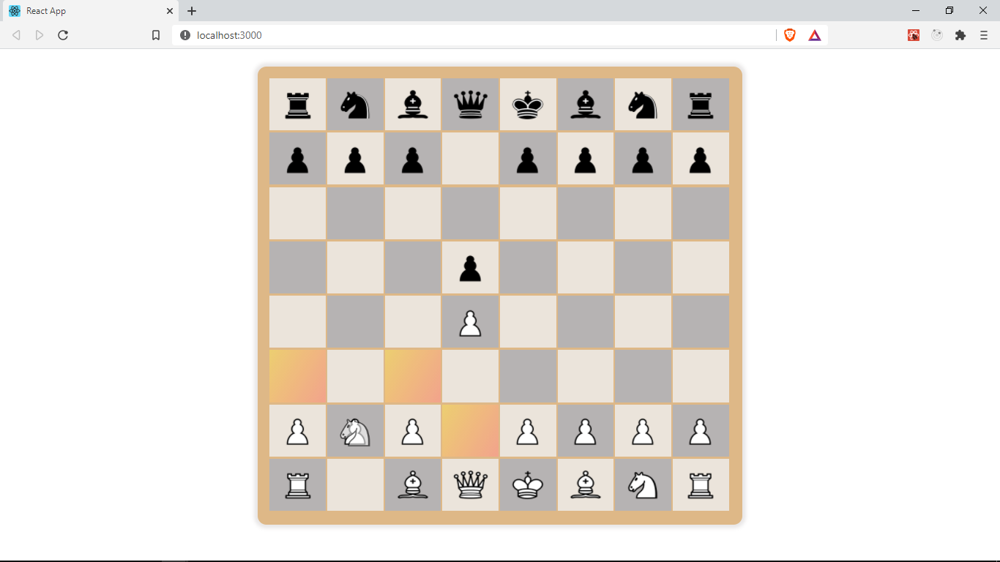

## Overview

In the previous section, we were able to drag and drop pieces to make moves. In this section, we will focus on improving our players' experience by highlighting some of their valid cell options (candidate cells) once they start to drag a piece.

So far, we have been working with `useState` to manage state/data in our `Game` component and then passing down that data to other components such as `Board` and `Cell` through _props_. Whenever we update the state, e.g by calling `setFen`, our `Game` component is updated and so are our our other components since they receive new _props_.

## Context API

To highlight valid cells for a move, we can follow the same approach by creating a new variable to hold the valid moves i.e `const [validMoves, setValidMoves] = useState([])` and then pass down the `validMoves` value via _props_ to the `Board` then to the `Cell` component that needs to be updated.

While this approach will work, as we add more features and state values to our game, we will also have to pass in more props down to our components.
To avoid this, we will use another state management solution by React called the Context API. It allows us to share state values between components without having to pass them around through _props_. This will help us manage more values in state such as candidate cells, game over status, captured pieces and more, without passing in more _props_ to our _Board_, _Cell_ and _Piece_ components.

To get started let's create a new folder in `src` and name it `context`. In the context folder, create a new file `GameContext.js`.

```
├───assets
│   └───pieces
├───components
│   ├───board
│   ├───cell
│   └───piece
├───context
├───functions
└───pages
    └───Game
```

In `GameContext.js`, let's add the following

```js
// src/context/GameContext.js
import React, { createContext, useReducer } from 'react';
import GameReducer from './GameReducer';

const initialState = {
	possibleMoves: [],
};

export const GameContext = createContext(initialState);

export const GameProvider = ({ children }) => {
	const [state, dispatch] = useReducer(GameReducer, initialState);

	return (
		<GameContext.Provider value={{ ...state, dispatch }}>
			{children}
		</GameContext.Provider>
	);
};
```

We create a new context object using `createContext()`, and provide an initial state value, which is our object with `possibleMoves: []`. Next, we create a `GameProvider` component, it takes a special _prop_ called `children`. The `children` _prop_ refers to the child nodes or content passed to this component within it's tags. See the short example below

```java
const SomeComponent ({children}) => <p>{children}</p>; //Hello world
<SomeComponent>
    Hello world
</SomeComponent>
```

Next we use the `useReducer` hook. It's an alternative to `useState`. It makes it easier to manage and update complex or deeply nested states. It takes in a reducer function, which is a function that updates the state, and the initial state value, `initialState`. It also returns an array with two values. The first value is the `state` and the second value is a function called `dispatch` that is used to trigger state updates. Whenever we call `dispatch`, the reducer function we passed in i.e `GameReducer` is going to be called to update the state.

Finanlly we return the `children` wrapped in `GameContext.Provider`. `GameContext.Provider` takes a `value` _prop_ where we pass the state and any values we want to share with all the components in this tree.
For the `value` _prop_, we provide an object with all the properties in our `state`, which in this case is only the `possibleMoves` array, we also provide dispatch so that we can easiliy trigger state updates from nested children components.

That's it for the _context_ set up. Let's create our `GameReducer` function in `src/context/GameReducer.js`.

```js
//src/context/GameReducer.js
import { types } from './actions';

const getPositions = (moves) => {
	return moves.map((move) => {
		const n = move.length;
		return move.substring(n - 2);
	});
};

const GameReducer = (state, action) => {
	switch (action.type) {
		case types.SET_POSSIBLE_MOVES:
			return {
				...state,
				possibleMoves: getPositions(action.moves),
			};
		case types.CLEAR_POSSIBLE_MOVES:
			return {
				...state,
				possibleMoves: [],
			};
		default:
			return state;
	}
};

export default GameReducer;
```

## Reducers

A reducer is a function that updates our state. It takes in the original _state_ value as its first argument and an `action` as its second, and based on the type of this action, it returns a new updated state.
This actions are usually _dispatched_ from our components as we will see in a moment.

We use a `switch` statement to check the action type and handle different cases. If the type of action dispatched is `types.SET_POSSIBLE_MOVES` we return a new object and update the `possibleMoves` property to what is returned from `getPositions(action.moves)`. When this action is _dispatched_ from our `Game` component, the reducer will receive a property from the action called `moves`, it will be an array of the possible moves that need to be set e.g `[a3, a4]`. This `moves` array can include the actual pieces e.g `['Na3', 'Nc3', 'Nf3', 'Nh3']`. That's why we use the `getPositions` function to extract the cell information and pass this value to our `possibleMoves` property.

```java
let moves = ['Na3', 'Nc3', 'Nf3', 'Nh3'];
getPositions(moves); //["a3", "c3", "f3", "h3"]
```

When the type of action dispatched is `types.CLEAR_POSSIBLE_MOVES`, we update our state by returning a new object and setting the `possibleMoves` property to `[]`. We will _dispatch_ this action after the player finally makes a move and we now need to unhighlight any highlighted cells.

## Actions

Let's create a file for this actions in `src/context/actions.js`. Actions are just constants to express various events/intents in our app.

Let's add the following actions for now

```java
export const types = {
	SET_POSSIBLE_MOVES: 'SET_POSSIBLE_MOVES',
	CLEAR_POSSIBLE_MOVES: 'CLEAR_POSSIBLE_MOVES',
};
``
```

## useContext

Now let's make use of our context in our components to complete this feature.

In the `Game` component we need to make the following additions. The rest of the code remains unchanged :)

```java
// src/pages/Game.jsx
import React, { useState, useRef, useEffect, useContext } from 'react';
import { GameContext } from '../../context/GameContext';
import { types } from '../../context/actions';

// inside the Game component.
const { dispatch } = useContext(GameContext);
const makeMove = (pos) => {
		const from = fromPos.current;
		const to = pos;
		chess.move({ from, to });
		dispatch({ type: types.CLEAR_POSSIBLE_MOVES });
		setFen(chess.fen());
};

	const setFromPos = (pos) => {
		fromPos.current = pos;
		dispatch({
			type: types.SET_POSSIBLE_MOVES,
			moves: chess.moves({ square: pos }),
		});
	};
```

First, we import the `useContext` hook from React. `useContext` takes in a _context_ value created using `React.createContext` like our `GameContext`.
`useContext` gives us access to the _state_ values we provided in our context provider i.e `GameContext.Provider` such as `dispatch`.

In the `setFromPos`, which is called once a Piece is dragged (`onDragStart`), we make use of the `dispatch` function to _dispatch_ an event of type
`types.SET_POSSIBLE_MOVES`, we also provide a `moves` property whose value we get from calling
`chess.moves({ square: pos })` which returns a list of possible moves. Our `GameReducer` is called and it updates our `setPossibleMoves` array with the `action.moves` dispatched.

In the `makeMove` function, we _dispatch_ an action of type `types.CLEAR_POSSIBLE_MOVES`
Our reducer function is called and it receives this action and updates our _state_ by setting `possibleMoves: []`

To highlight our cells based on whether they are candidate moves, we need to get the current array of `possibleMoves` from our state. We can do that in the `Cell` component by using the `useContext` hook and providing our `GameContext`.

```java {12-13}
// src/components/Cell/index.jsx
import React, { useContext } from 'react';
import PropTypes from 'prop-types';
import './cell-styles.css';
import { isLightSquare, Cell as BoardCell } from '../../functions/';
import Piece from '../piece';
import { GameContext } from '../../context/GameContext';

const Cell = ({ cell, index, makeMove, setFromPos }) => {
	const light = isLightSquare(cell.pos, index);

	const { possibleMoves } = useContext(GameContext);
	const isPossibleMove = possibleMoves.includes(cell.pos);

	const handleDrop = () => makeMove(cell.pos);

	return (
		<div
			className={`cell ${light ? 'light' : 'dark'}`}
			onDrop={handleDrop}
			onDragOver={(e) => e.preventDefault()}
		>
			<div className={`overlay ${isPossibleMove && 'possible-move'}`}>
				<Piece pos={cell.pos} name={cell.piece} setFromPos={setFromPos} />
			</div>
		</div>
	);
};

// propTypes remain unchanged
```

We get the `possibleMoves` from state and then check if this Cell's position is a possible move by
`possibleMoves.includes(cell.pos)`

In our return statement, we wrap our `Piece` in a _div_ with a className `overlay`, we also apply the className `possible-move` conditionally if this cell is a possible move. That className adds a linear gradient to our cell to highlight it. See the modified css below

```css
.cell {
	width: calc((100vh * 0.9) / 9.6);
	height: calc((100vh * 0.85) / 9.4);
	padding: 0.25rem 0.35rem;
	position: relative;
}
.overlay {
	position: absolute;
	top: 0;
	left: 0;
	width: 100%;
	height: 100%;
	display: flex;
	justify-content: center;
	align-items: center;
}

.light {
	background-color: rgb(235, 228, 219);
}
.dark {
	background-color: #b6b3b3;
}

.possible-move {
	background-image: linear-gradient(120deg, #f6d365 0%, #fda085 100%);
	opacity: 0.85;
}
```

With that in place, we now get some highlighted cells to show us the valid moves we can make (Candidate cells)



Get the completed source code for this lesson [here](https://github.com/franknmungai/live-chess/tree/07-highlighting-candidate-cells)
