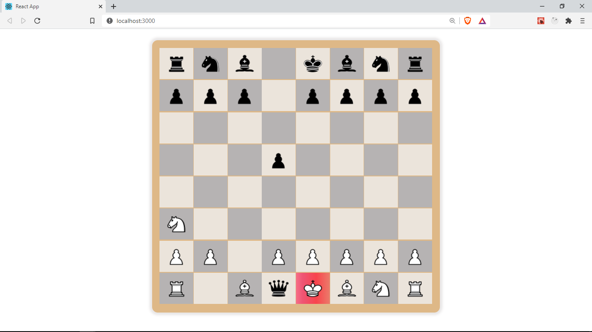

## Overview

In the previous section we improved the player's experience by adding highlighting of candidate cells in order to show a player their valid moves options.

In this section we will be improving the player's experiece further by giving them a hint whenever they are in [check](<https://en.wikipedia.org/wiki/Check_(chess)>) by highlighting the cell holding their king in a red color. In chess, when a player is in check, it means that their King is in danger of being captured by their opponent's next move. This player should make a valid move to get out of _check_ by moving their king to a safe cell/square, blocking the attacking piece from capturing their king, or capturing the attacking piece.

Chess.js offers a method we can use to check if the next side to move is in check.
`chess.in_check()` returns `true` if the side to move is in _check_ otherwise `false`.

## Approach

In our `Game` component we can check if the next player is in _check_ after every move made. Then we will dispatch an action to our reducer which updates a property in our `GameContext` state called `check`. We will then use this property in our `Cell` component to see if the current player is in _check_ in order to change some styling in the cell to give the player a hint.

Let's get started with this flow. Inside our `Game` component in `src/Pages/Game/index.jsx` add the following `useEffect`. The rest of the code remains unchanged.

```java
// src/Pages/Game/index.jsx
useEffect(() => {
    dispatch({
        type: types.SET_TURN, //import types from '../../context/actions'
        player: chess.turn(),
        check: chess.in_check(),
    });
}, [fen, dispatch, chess]);
```

## useEffect dependencies

Be sure to add this `useEffect` call inside the `Game` component body. `useEffect` here runs everytime the values in our `dependencies` array changes. We have three values in our dependencies array provided to `useEffect`. These are `[fen, dispatch, chess]`. The first value `fen` makes sure that this effect runs everytime our `fen` changes, which happens to be after every move, because we update our `fen` in the `makeMove` function by calling `setFen(...)`. Our other 2 values in the array are `dispatch` and `chess`. These will not actually change in our component lifecyle but it is recommended to include any externally declared variables used in our `useEffect` as part of our dependencies array.

Inside our `useEffect`, we `dispatch` an action of type `types.SET_TURN` and also provide two values as part of the action. These are `player` and `check`. Actions (Objects passed to `dispatch`) must have a type property, this is required, and we can also pass in any other properties we might need in the reducer to update the state (this is optional). We use ` chess.turn()` to get the player who is in turn, this can either be `b`(black) or `w`(white). It is very crucial that we keep track of the turns in order to know whose turn it is when `chess.in_check()` is true, and give them a hint.

That's all for the `Game` component. View the current source code for the `Game` component [here](https://gist.github.com/franknmungai/2fe4c9024cada721482b800078864f86)

## Updating the reducer

Next, we need to update our reducer function `GameReducer` to update the state for this new action `types.SET_TURN`
In `src/context/GameReducer.js` let's add the following case in our _switch_ statement. The rest of the code remains the same :)

```js
// src/context/GameReducer.js
case types.SET_TURN:
  return { ...state, turn: action.player, check: action.check };
```

We return a new state by copying/spreading the previous state `...state` and setting the `turn` and `check` properties to what we received in our action.

## Updating the actions

Let's also make sure we define the `SET_TURN` action in our actions `src/context/actions.js`.

```java
export const types = {
	SET_POSSIBLE_MOVES: 'SET_POSSIBLE_MOVES',
	CLEAR_POSSIBLE_MOVES: 'CLEAR_POSSIBLE_MOVES',
	SET_TURN: 'SET_TURN',
};
```

In `GameContext.js` at `src/context/GameContext.js` where we defined the initial state we used to create the _context_, let's add two properties, `turn` and `check`.

```java
// src/context/GameContext.js
const initialState = {
	possibleMoves: [],
	turn: 'w', //w or b. w goes first so its the default
	check: false, //true if the side to move (current turn) is in check.
};
```

`turn` will hold either `b` or `w` depending on who is playing next and `check` which will be either `true` or `false` depending on whether the player in turn is in _check_. This are the properties we update in our `GameReducer` when the action of type `SET_TURN` is dispatched.

## `Cell`

Finally let's use add the following to the `Cell` component in `src/components/cell/index.jsx` to complete this feature

```java {14-20}
// src/components/cell/index.jsx
import React, { useContext } from 'react';
import PropTypes from 'prop-types';
import './cell-styles.css';
import { isLightSquare, Cell as BoardCell } from '../../functions/';
import Piece from '../piece';
import { GameContext } from '../../context/GameContext';

const Cell = ({ cell, index, makeMove, setFromPos }) => {
	const light = isLightSquare(cell.pos, index);

	const { possibleMoves, turn, check } = useContext(GameContext);
	const isPossibleMove = possibleMoves.includes(cell.pos);

	const color = cell.piece.toUpperCase() === cell.piece ? 'w' : 'b';

	const inCheck = () => {
		const king = cell.piece.toUpperCase() === 'K';
		return turn === color && king && check;
	};

	const handleDrop = () => makeMove(cell.pos);

	return (
		<div
			className={`cell ${light ? 'light' : 'dark'}`}
			onDrop={handleDrop}
			onDragOver={(e) => e.preventDefault()}
		>
			<div
				className={`overlay ${isPossibleMove && 'possible-move'} ${
					inCheck() && 'check'
				}`}
			>
				<Piece pos={cell.pos} name={cell.piece} setFromPos={setFromPos} />
			</div>
		</div>
	);
};

Cell.prototype = {
	cell: PropTypes.instanceOf(BoardCell).isRequired,
	index: PropTypes.number.isRequired,
	makeMove: PropTypes.func,
	setFromPos: PropTypes.func,
};
export default Cell;
```

In `Cell` component we get the `turn` and `check` properties from our _context_ through
`useContext()`
We determine the color of the Piece held by this cell and then use this color in the `inCheck` function to determine if we need to highlight this cell. We only need to highlight the cell holding the king of the player in turn `turn === color && king && check`. If that condition is true, we apply a className `check` in the _div_ that wraps the `Piece`. That className applies a linear gradient to the Cell.

```css
/* src/components/cell/cell-styles.css */
/* The rest of the css remains the same */
.check {
	background-image: linear-gradient(
		to right,
		#f66f88 0%,
		#ee5574 19%,
		#f8444d 60%,
		#eb7b6a 100%
	);
}
```

Now we can see a helpful warning color on White's king who is in check.



In the next section, we will be handling the _Game over_ case

Get the code for this lesson [here](https://github.com/franknmungai/live-chess/tree/08-highlight-cell-on-check)
