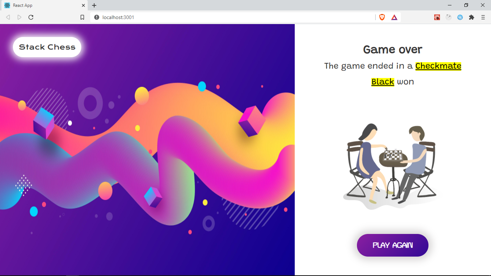

## Overview

Currently when the game is on, we display the `Board` component to the players. When the game is over we want to show a different `GameOver` component which we will work on. This component will show the players the _status_ of the game (We'll see what _status_ means in a moment) and in case there was a winner, it will also show which player won _black_ or _white_

Here's a preview of what it looks like



## What does Game Over mean in Chess

In chess, there are four scenarios that would lead to a game being considered over and not all this cases have a clear winner. Chess.js has methods that can help us check for this scenarios.

1. [Checkmate](https://en.wikipedia.org/wiki/Checkmate)

   - When the King of the player in turn is in check and they have no legal move to escape check, they've been checkmated and lose the game

   ```java
   //Returns true or false if the side to move has been checkmated.
   chess.in_checkmate();
   ```

2. [Stalemate](https://en.wikipedia.org/wiki/Stalemate)

   - When the next player in turn is not in _check_ but has no legal move they can make

   ```java
   //Returns true or false if the side to move has been stalemated.
   chess.in_stalemate()
   ```

3. [Threefold repetition](https://en.wikipedia.org/wiki/Threefold_repetition)

   - A player may claim a draw if the same position occurs three times on their turn because such a game might go on indefinitely.

   ```java
   //Returns true or false if the current board position has occurred three or more times.
   chess.in_threefold_repetition()
   ```

4. [Insufficient material](https://chess24.com/en/read/glossary/insufficient-material)

   - The the game is immediately declared a draw if there is no way to end the game in _checkmate_ due to insuffient pieces. e.g k vs K

   ```java
   //Returns true if the game is drawn due to insufficient material  otherwise false
   chess.insufficient_material()
   ```

5. [Draw](<https://en.wikipedia.org/wiki/Draw_(chess)>)

   - If any of the cases 2, 3 or 4 are occur, then the game ends in a draw and there is no winner.
     We only have a winner if the game ends in _checkmate_.

   ```java
   //Returns true or false if the game is drawn
   chess.in_draw()
   ```

## `getGameOverState` function

To get started, let's create a function `getGameOverState` in `src/functions/game-over.js` that checks through this cases.

```java
// src/functions/game-over.js
/**
 *
 * @param {*} chess An instance of the current Chess object
 * @returns {[boolean, string]}
 */
const getGameOverState = (chess) => {
	if (!chess.game_over()) {
		return [false, ''];
	}
	if (chess.in_checkmate()) {
		return [true, 'checkmate'];
	}

	if (chess.in_stalemate()) {
		return [true, 'stalemate'];
	}
	if (chess.in_threefold_repetition()) {
		return [true, 'three fold repetition'];
	}
    if (chess.in_draw()) {
		return [true, 'draw'];
	}
};

export default getGameOverState;
```

The `getGameOverState` function takes in the chess object and returns an array of two values. The first value is a boolean depending on whether the game is over or not and the second value is the game over _status_ e.g _checkmate_ or _stalemate_

## `GAME_OVER` action

Next, we use this function in our `Game` component to determine the game over status.
We can check for game over status in our `useEffect` call that runs everytime a move is made (the _fen_ is updated).
Initially we were only dispatching the event `type: types.SET_TURN`, but now, we first get the game over status by calling `getGameOverState(chess)`. It returns the `gameOver` value and the status. If `gameOver` is _true_, we dispatch an action of type `types.GAME_OVER`, we also provide the `status` and the `player` in turn as part of the action.

```java {3-7}
// src/pages/Game/index.jsx
	useEffect(() => {
		const [gameOver, status] = getGameOverState(chess);
		if (gameOver) {
			dispatch({ type: types.GAME_OVER, status, player: chess.turn() });
			return;
		}
		dispatch({
			type: types.SET_TURN,
			player: chess.turn(),
			check: chess.in_check(),
		});
	}, [fen, dispatch, chess]);
```

Let's update the GameReducer function which updates our Game state. In `src/context/GameReducer.js` add a new case for the `types.GAME_OVER` action.

```java
case types.GAME_OVER:
    return {
        ...state,
        gameOver: true,
        status: action.status,
        turn: action.player,
    };
```

We set `gameOver` to true, and set `status` and `turn` to what we receive from `action.status` and `action.player` respectively. The value of `turn` will help us find out which player has been checkmated in case the game ended in a _checkmate_.

Let's add the `gameOver` and `status` value as part of our initial state in `src/context/GameContext.js`

```java
// src/context/GameContext.js
const initialState = {
	possibleMoves: [],
	turn: 'w', //w or b
	check: false, //true if the side to move (current turn) is in check.
	gameOver: false,
	status: '', //game over status e.g checkmate or stalemate
};
```

## `GameOver` component

Let's create the `GameOver` component which will be rendered when `gameOver` is true.
We saw a preview of this component at the beginning of this section.

To get started, let's create a new folder in `src/component` and save it as `layout`.

```
components
├───board
├───cell
├───layout
└───piece
```

In `/components/layout` create a new file `index.jsx` where we will create a `Layout` component. This component will give us the general layout we will use in the `GameOver` component. it's going to be a resusable component so that we can easily reuse the same layout in our App. Let's also create the stylesheet for this component in `layout/layout-styles.css`;

```
layout
├───index.jsx
└───layout-styles.css
```

For the Layout component, let's add the following in `index.jsx`

```java title="/src/components/Layout/index.jsx"

import React from 'react';
import './layout-styles.css';
const Layout = ({ Image, Content }) => {
	return (
		<div className="container">
			<div className="app-title">Stack Chess</div>
			<div className="flex">
				<Image />
				<div className="content">
					<Content />
				</div>
			</div>
		</div>
	);
};
export default Layout;
```

The `Layout` component take two _props_. These props will be components. The first prop is `Image` to show the `<Image/>` and the second prop is `Content` for the <Content/>. The Layout component aligns the `Image` and `Content` components we receive in props as shown in the preview.
The styling is applied through `layout-styles.css`. To keep this section short, we decided to share the CSS through a GitHub gist, you can find it [here](https://gist.github.com/franknmungai/10cd5af0cb7e5247f935edbd2bc816af) and add it to your own `layout-styles.css` file.

We make use of some external fonts in the `layout-styles.css`. To make them available, include the following tag in `public/index.html` within the `head` tag.

```html title="public/index.html"
<link
	href="https://fonts.googleapis.com/css2?family=Grandstander&family=Krona+One&family=Turret+Road:wght@500&display=swap"
	rel="stylesheet"
/>
```

Now let's use this `Layout` component to easily create our `GameOver` component.
In `src/components`, create a new folder `gameover` and in the folder add two files `index.jsx` and `game-over.styles.css`

```
components
├───board
├───cell
├───gameover
├───layout
└───piece
```

```
gameover
├───index.jsx
└───gameover-styles.css
```

Let's create our `GameOver` component in `gameover/index.jsx` by adding the following

```jsx title="/src/components/gameover/index.jsx"
import React, { useContext } from 'react';
import { GameContext } from '../../context/GameContext';
import Layout from '../layout';
import './gameover-styles.css';

const GameOver = () => {
	const { status, turn } = useContext(GameContext);
	let winner;
	if (status === 'checkmate') {
		if (turn === 'b') {
			winner = 'white';
		} else {
			winner = 'black';
		}
	}

	const Content = () => (
		<React.Fragment>
			<h1>Game over</h1>
			<p>
				The game ended in a <mark>{status}</mark>
			</p>
			{winner && (
				<p>
					<mark>{winner}</mark> won
				</p>
			)}
			
			<button>Play Again</button>
		</React.Fragment>
	);

	const Image = () => (
		
	);
	return <Layout Image={Image} Content={Content} />;
};

export default GameOver;
```

First, we get our `status` and `turn` from `useContext`. If the status is _checkmate_, then the player in turn has lost and we assign our _winner_ variable accordingly.
Next, we create a `Content` component that shows the _status_ of the game. If there is a _winner_, then the winner will be displayed `{winner && ( <p> <mark>{winner}</mark> won </p> )}`.
We also have an image and a _play again_ button that does nothing for now. Notice that our _return_ statement in `Content` is wrapped in `<React.Fragment/>`.It's just an empty wrapper to ensure that we _return_ a single top-level element since we can't return multiple elements, `React.Fragment` doesn't get inserted in the _DOM_ and it has no semantic meaning.

Next we create an Image component that displays the main image we want to have in our layout.
Finally we _return_ the Layout component providing the `Image` and `Content` as _props_.
To get this images download all the assets used in this project from [here](../static/assets.rar).

To style this let's add some css in `gameover-styles.css`. You can find the css [here](https://gist.github.com/franknmungai/77ecdcf4be99ff4e0a7f7397f4eb58c3)

## Early conditional return

When `gameOver` is _true_, we need to render a different component other than the `Board`. In our `Game` component, let's get the `gameOver` value from our _context_ and return a different component if `gameOver` is true.
Only change the newly added lines, the rest of the code remains unchanged. Find the complete code snippet for the `Game` component [here](https://gist.github.com/franknmungai/95160a2f62ac38a8489d83caebbc0485)

```java {3-7} title="/src/pages/Game/index.jsx"

const Game = () => {
    const { dispatch, gameOver } = useContext(GameContext);
    // The rest of the code is the same
    if (gameOver) {
		return <GameOver />;
	}
	return (
		<div className="game">
			<Board cells={board} makeMove={makeMove} setFromPos={setFromPos} />
		</div>
	);
}
```

:::note
Ensure that the early conditional _return_ for _gameOver_ is used after all your hooks have been defined.

```java
 if (gameOver) {
	return <GameOver />;
}
```

Just make sure it's at the bottom of the component, right before the main _return_ statement.
This is because hooks should be used at the top level of your component, and before any early _return_ statements like we have here. Read more about the [rules of hooks](https://reactjs.org/docs/hooks-rules.html)
:::

To test this out, temporily replace the _FEN_ in your `Game` component with the following values

```java
// checkmate
const FEN = 'rnb1kbnr/pppp1ppp/8/4p3/5PPq/8/PPPPP2P/RNBQKBNR w KQkq - 1 3';
```


```java
// draw
const FEN = '4k3/4P3/4K3/8/8/8/8/8 b - - 0 78';
```


