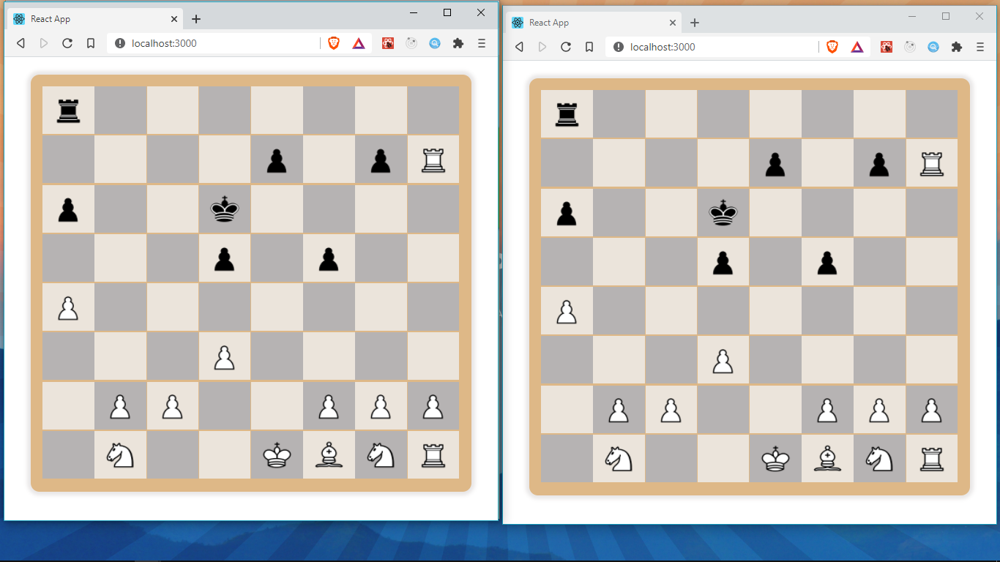

In the previous section, we created a webserver that uses web sockets for real-time communication.
We will now use this Webserver to communicate between players by emitting and listening for events.

Let's first install the socket.io-client library into our chess-client project by running

```js
npm i socket.io-client
```

Make sure you run this command in the chess-client directory root.

## Creating a socket and listening for events

In the _Game_ component, let's import _socket-io-client_ and create a _socket_

```js
import io from 'socket.io-client';
const socket = io('localhost:5000');
```

We our socket is connected to `localhost:5000`, where our Chess server is running.

In our `Game` component, let's add a `useEffect` hook from where we can _listen_ for all events coming from our server. `useEffect` is great for setting up such listeners.

```jsx title="src/pages/Game/index.jsx"
useEffect(() => {
	socket.emit('join', { name: 'Frank', gameID: '20' }, ({ error, color }) => {
		console.log({ color });
	});
	socket.on('welcome', ({ message, opponent }) => {
		console.log({ message, opponent });
	});
	socket.on('opponentJoin', ({ message, opponent }) => {
		console.log({ message, opponent });
	});

	socket.on('opponentMove', ({ from, to }) => {
		chess.move({ from, to });
		setFen(chess.fen());
	});
	socket.on('message', ({ message }) => {
		console.log({ message });
	});
}, [chess]);
```

First, we emit a _join_ event providing our `name` and `gameID`, these are hard-coded but we will make them dynamic in the next section. The server adds us to the game and responds through the callback where we receive the `color` assigned to us. In case of an error, we also receive the error which we will handle later.

Next, we listen for the _welcome_ event from the server, we receive a `message` and `opponent`.
We also listen for the _opponentMove_ event, we receive the `to` and `from` cell positions, and use this to make a move `chess.move()` and to update our `fen`. This updates our board to reflect our opponent's move

We also listen for the _message_ event. We will handle this events later.

## Emitting the _move_ event

In our `makeMove` function, we added `socket.emit` to emit a _move_ event, providing a `gameID` and the `from` and `to` cell positions. This will be broadcasted by our server to the other player in the `opponentMove` event.

```jsx title="src/pages/Game/index.jsx"
const makeMove = (pos) => {
	const from = fromPos.current;
	chess.move({ from, to: pos });
	dispatch({ type: types.CLEAR_POSSIBLE_MOVES });
	setFen(chess.fen());
	socket.emit('move', { gameID: '20', from, to: pos });
};
```

That's all we need to connect and communicate between two players through a web-server. Find the code snippet for the `Game` component in [this](https://gist.github.com/franknmungai/9f0906536381a10db9ee4ff6bbb7e44e) gist.

[Section branch](https://github.com/franknmungai/live-chess/tree/10-socket-io-client)

To test this out, make sure the server is running on `localhost:5000` and open the react app in two different tabs or windows.

Open the browser console `Ctrl+Shift+i` and see the logs, should be something like this. These are from the events we receive.

```
{color: "w"}
{message: '...', opponent: {color: "b"
gameID: "20"
name: "Frank"
playerID: "jsxReq4yHsVA1eaTAAAA"}}

{message: "message: "Let's start the game. White (Frank) goes first""}
```

Try making moves in one window and you should see the moves updated in the other window


