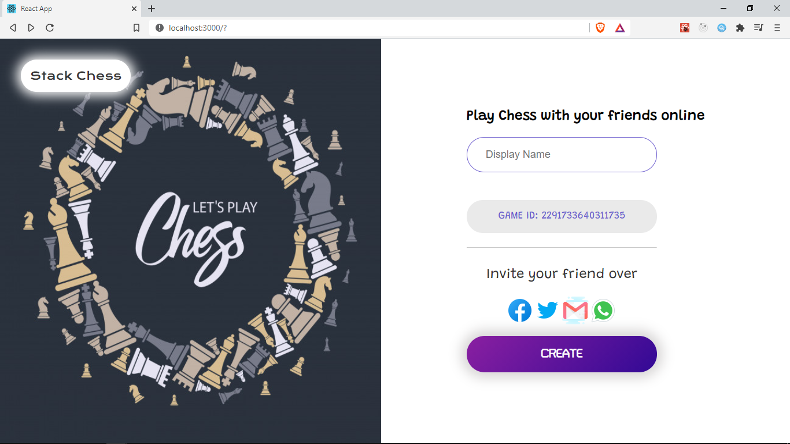

## Overview

In this section, we will create a Home page that displays a form to allow users to create a game, invite others or join games. We will also set up navigation between the `Home` page and the `Game` page using [React Router](https://reactrouter.com/web/guides/quick-start).

In `src/pages` create a new folder `Home` and add two files, `index.jsx` and `home-styles.css`

```{1}
pages
├───Home
└───Game
```

```
Home
├───index.jsx
└───home-styles.css
```

## Home page

In `pages/Home/index.jsx` add the following code for the Home page

```jsx title="/src/pages/Home/index.jsx"
import React, { useState, useEffect } from 'react';
import Layout from '../../components/layout';
import './home-styles.css';
import ShareButtons from '../../components/share-buttons';
import Button from '../../components/button';

const Form = () => {
	const [name, setName] = useState('');
	const [gameID, setGameID] = useState('');

	useEffect(() => {
		const id = Math.random().toString().replace('0.', '');
		setGameID(id);
	}, []);

	const handleSubmit = (event) => {
		event.preventDefault();
	};

	return (
		<div>
			<h2>Play Chess with your friends online</h2>
			<form onSubmit={handleSubmit}>
				<input
					type="text"
					className="input"
					value={name}
					onChange={({ target }) => setName(target.value)}
					placeholder="Display Name"
				/>
				<div className="gameId">Game ID: {gameID}</div>
				<hr />
				<p className="invite">Invite your friend over</p>
				<ShareButtons
					shareText={`https://stack-chess.netlify.app?id=${gameID}`}
					subject="Join me for a game of Chess on Stack Chess"
				/>

				<Button>Create</Button>
			</form>
		</div>
	);
};
const Home = () => {
	const Image = () => (
		
	);
	return <Layout Content={Form} Image={Image} />;
};

export default Home;
```

We create a `Form` component with `name` and `gameID` as state values. We create and set a random `gameID` when this component is mounted on `useEffect`.
The `<input/>` is controlled i.e it's value comes from the `name` _state_ and we update the `name` _state_ on every change. This helps us get the value of the input from our _state_ and is a good way to manage form input elements.
Read more on [controlled components](https://reactjs.org/docs/forms.html)

```jsx
<input value={name} onChange={({ target }) => setName(target.value)} />
```

In the `Home` component, we return the `Layout` component created earlier, passing the `Form` as the value of the `Content` prop and the Image component as the `Image` prop.

Let's include some styles for the Home page in `pages/Home/home-styles.css`

```css title="/src/pages/Home/home-styles.css"
form {
	width: 80%;
	height: 100%;
}

.input {
	width: 80%;
	padding: 1.2rem 2rem;
	outline: none;
	border: 1px solid slateblue;
	border-radius: 48px;
	margin: 24px 0;
	font-size: 18px;
}

.gameId {
	background-color: #eaeaea;
	color: slateblue;
	border-radius: 48px;
	padding: 1.2rem 2rem;
	margin: 24px 0;
	font-size: 18px;
	text-transform: uppercase;
}

.home-img {
	width: 50%;
	height: 100%;
	left: 0;
}

hr {
	margin: 24px 0;
	font-size: 18px;
}

.share {
	margin: 16px auto;
	width: 50%;
}
```

## Reusable components

We also make use of `ShareButtons` component which shows some social media icons we can click on to share the link for this game.

Let's create this component in `src/components/share-buttons` create two files `index.jsx` and `share-buttons-styles.css`

```py {7}
components
├───board
├───cell
├───gameover
├───layout
├───piece
└───share-buttons
```

```
share-buttons
├───index.jsx
└───share-buttons-styles.css
```

Let's add the code for this component in `share-buttons/index.jsx`.

```jsx title="/src/components/share-buttons/index.jsx"
import React from 'react';
import './share-buttons-styles.css';

const ShareButtons = ({ shareText, subject }) => {
	const links = [
		{
			name: 'facebook',
			url: `https://www.facebook.com/sharer/sharer.php?u=${shareText}`,
		},
		{
			name: 'twitter',
			url: `https://twitter.com/messages/compose?recipient_id=&text=${shareText}`,
		},
		{
			name: 'gmail',
			url: `mailto:?Subject=${encodeURIComponent(subject)}&body=${encodeURI(
				shareText
			)}`,
		},

		{
			name: 'whatsapp',
			url: `https://api.whatsapp.com/send?text=${shareText}`,
		},
	];
	return (
		<div className="share">
			{links.map((link) => (
				<a
					href={link.url}
					rel="noopener noreferrer"
					target="_blank"
					key={link.name}
				>
					
				</a>
			))}
		</div>
	);
};

export default ShareButtons;
```

We have a list of `links`, each link has a `name` ( of the site ) and the `url` to share through their API. We use `.map` to convert them into a list of elements `<a/>`. We pass the `shareText` and `subject` which are received as _props_ to this _links_. The `shareText` is just a message with an invite link to this game

We also `require` an image for each link from our assets folder `../../assets/social/${link.name}.png`

Let's add the styles in `share-buttons/share-buttons.styles.css`

```css title="/src/components/share-buttons/share-buttons-styles.css"
.share {
	display: flex;
	align-items: center;
	justify-content: space-around;
}
```

We also used a `Button` component. This is a resusable button extracted from our `GameOver` component.
Let's create this button component in `src/components/button/index.jsx`

```py {2}
├───board
├───button -> create this
├───cell
├───gameover
├───layout
├───piece
└───share-buttons
```

```
button
├───index.jsx
└───button-styles.css
```

```jsx title="/src/components/button/index.jsx"
import React from 'react';
import './button-styles.css';

const Button = ({ onClick, children }) => {
	return (
		<button onClick={onClick} className="button">
			{children}
		</button>
	);
};

export default Button;
```

It receives the `onClick` event handler as a _prop_ and a `children` _prop_ for the text to show.

```css title="/src/components/button/button-styles.css"
.button {
	padding: 1.3rem 2.75rem;
	text-transform: uppercase;
	color: #fff;
	background-image: linear-gradient(135deg, #8a1fa1 0%, #320995 100%);
	border: none;
	box-shadow: 0 0 20px 10px #d8d6d6;
	border-radius: 3.5rem;
	outline: none;
	font-weight: bold;
	font-size: 20px;
	cursor: pointer;
	font-family: 'Turret Road', cursive;
	width: 90%;
	margin-top: 1.5rem;
}
```

We will also reuse this button in the `GameOver` component.

## Routing

Next, let's add routing/navigation to transition from the Home page to the Game page.
For this, let's install [React Router](https://reactrouter.com/web/guides/quick-start), a package which helps us handle client side navigation in React apps.
In your project root folder run:

```
npm i react-router-dom
```

In `src/App.js` create the routes for our App.

```jsx title="/src/App.js" {2,10-15}
import React from 'react';
import { BrowserRouter as Router, Route } from 'react-router-dom';
import Game from './pages/Game';
import Home from './pages/Home';
import { GameProvider } from './context/GameContext';
import './App.css';

function App() {
	return (
		<Router>
			<GameProvider>
				<Route path="/" exact component={Home} />
				<Route path="/game" component={Game} />
			</GameProvider>
		</Router>
	);
}

export default App;
```

We import the `BrowserRouter`component and rename it to `Router`. This should wrap all our routes.
Next, we import a `Route` component which we use to specify the component to show for each path in our app.
For the home path `/` we provide our `Home` component and this will get displayed. We use the `exact` prop to ensure that the path name is an exact match in order to render the `Home` component.

```jsx
<Route path="/" exact component={Home} />
```

For the route `/game` we render the `Game` component.

```jsx
<Route path="/game" component={Game} />
```

With that set up, here is what our app's home page looks like



If you append `/game` to the address bar root url, you should see the `Game` component rendered.

The code for this section can be found in this [GitHub branch](https://github.com/franknmungai/live-chess/tree/11-homepage-and-routing)
