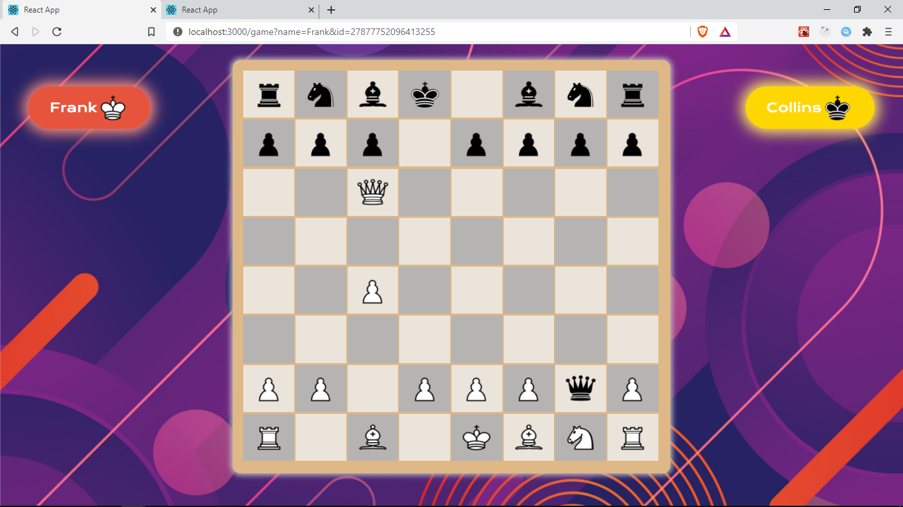

## Overview

So far, players can create games, invite other players and even play online.
In this section, we will be making some final improvements to the Game such as displaying the players' names, showing messages through toasts, and highlighting previous opponent moves.

To get started, we will first add some values to our initial state in `src/context/GameContext.js` to handle the new features

## Modifying the initial state

```js title="src/context/GameContext.js" {7-11}
const initialState = {
	possibleMoves: [],
	turn: 'w', //w or b
	check: false, //true if the side to move (current turn) is in check.
	gameOver: false,
	status: '', //game over status
	playerName: '',
	playerColor: '',
	opponentName: '',
	message: '',
	opponentMoves: [],
};
```

## More actions

We will update our actions to handle this new features

```js {7-47}
export const types = {
	SET_POSSIBLE_MOVES: 'SET_POSSIBLE_MOVES',
	CLEAR_POSSIBLE_MOVES: 'CLEAR_POSSIBLE_MOVES',
	SET_TURN: 'SET_TURN',
	GAME_OVER: 'GAME_OVER',

	SET_PLAYER: 'SET_PLAYER',
	SET_OPPONENT: 'SET_OPPONENT',
	SET_PLAYER_COLOR: 'SET_PLAYER_COLOR',
	SET_MESSAGE: 'SET_MESSAGE',
	CLEAR_MESSAGE: 'CLEAR_MESSAGE',
	SET_OPPONENT_MOVES: 'SET_OPPONENT_MOVES',
	CLEAR_OPPONENT_MOVES: 'CLEAR_OPPONENT_MOVES',
};

export const setPlayer = (name) => ({
	type: types.SET_PLAYER,
	name,
});

export const setOpponent = (opponent) => ({
	type: types.SET_OPPONENT,
	name: opponent?.name,
});

export const setPlayerColor = (color) => ({
	type: types.SET_PLAYER_COLOR,
	color,
});

export const setMessage = (message) => ({
	type: types.SET_MESSAGE,
	message,
});

export const setOpponentMoves = (moves) => ({
	type: types.SET_OPPONENT_MOVES,
	moves,
});

export const clearOpponentMoves = () => ({
	type: types.CLEAR_OPPONENT_MOVES,
});
```

This functions return _actions/objects_ and will be dispatched to update various parts of our context.

## Reducers

In our reducer, we need to handle this actions by updating the state accordingly.
Add the following cases to the reducer function in `src/GameContext/GameReducer.js`.

```js title="src/GameContext/GameReducer.js"
case types.SET_PLAYER:
    return { ...state, playerName: action.name };
case types.SET_PLAYER_COLOR:
    return { ...state, playerColor: action.color };
case types.SET_OPPONENT:
    return { ...state, opponentName: action.name };
case types.SET_MESSAGE:
    return { ...state, message: action.message };
case types.CLEAR_MESSAGE:
    return { ...state, message: '' };
case types.SET_OPPONENT_MOVES:
    return { ...state, opponentMoves: action.moves };
case types.CLEAR_OPPONENT_MOVES:
    return { ...state, opponentMoves: [] };
```

Each of this `case` statements updates the corresponding section in our application state.

## dispatch

Next, in our `Game` component, we update the `useEffect` where we listen to socket events. Whenever we receive an event, instead of logging out the data, let's dispatch this actions to update our state

```js title="/src/pages/Game/index.jsx"
useEffect(() => {
	socket.emit(
		'join',
		{ name: playerName.current, gameID: gameID.current },
		({ error, color }) => {
			if (error) {
				history.push('/');
			}
			dispatch(setPlayer(playerName.current));
			dispatch(setPlayerColor(color));
		}
	);
	socket.on('welcome', ({ message, opponent }) => {
		dispatch(setMessage(message));
		dispatch(setOpponent(opponent));
	});
	socket.on('opponentJoin', ({ message, opponent }) => {
		dispatch(setMessage(message));
		dispatch(setOpponent(opponent));
	});
	socket.on('opponentMove', ({ from, to }) => {
		chess.move({ from, to });
		setFen(chess.fen());
		dispatch(setMessage('Your Turn'));
		dispatch(setOpponentMoves([from, to]));
	});
	socket.on('message', ({ message }) => {
		dispatch(setMessage(message));
	});
}, [chess, history, dispatch]);
```

For each event i.e `socket.on('...')`, we get some data and dispatch an action with this data.

## Showing the Players name and color

To display the players' name and respective color, let's create a new component. In
`src/components/` create two new files `index.jsx` for the component and `player-styles.css` for the styling.

```
├───board
├───button
├───cell
├───gameover
├───layout
├───piece
├───player -> create this
└───share-buttons
```

```
player
├───index.jsx
└───player-styles.css
```

In the `/components/player/index.jsx` create the component by adding the following code

```jsx title="/src/components/player/index.jsx"
import React from 'react';
import './player-styles.css';

const Player = ({ name, color, player }) => {
	const white = color === 'w';
	const image = white ? 'wK' : 'bK';

	return (
		<div className={`player ${player ? 'you' : 'opponent'}`}>
			<p>{name}</p>
			
		</div>
	);
};

export default Player;
```

This component takes in the `name` and `color` of a player. It displays the `name` and a white or black king piece to show the player's color.
It also takes in a _player_ prop which will be _boolean_. It is used to set different classNames between the `Player` component showing _this_ player and the `Player` component showing their opponent. `` className={`player ${player ? 'you' : 'opponent'}`} `` This will be more clear when we see it in action shortly.

Add the following styles in `player-styles.css` to style this component.

```css title="/src/components/player/player-styles.css"
.player {
	margin: 1.5rem;
	padding: 0.5rem 2rem;
	text-align: center;
	color: rgb(56, 55, 55);
	border-radius: 2.5rem;
	position: absolute;
	z-index: 2;
	font-size: 1.2rem;
	cursor: pointer;
	font-family: 'Krona One', sans-serif;
	display: flex;
	align-items: center;
	justify-content: center;
	color: white;
}

.you {
	box-shadow: 0 0 20px 7px rgb(255, 143, 126);
	background-color: #e7543d;
	top: 2.5rem;
	left: 1.2rem;
}

.opponent {
	box-shadow: 0 0 20px 7px #fafafa;
	background-color: gold;
	top: 2.5rem;
	right: 1.2rem;
	box-shadow: 0 0 20px 7px rgb(255, 231, 97);
}

.king {
	width: 48px;
	height: 48px;
}
```

In the `Game` component, let's make use of the `Player` component to display the players in the `Game` the game. Make this changes (the rest of the code remains the same)

```js title="/src/pages/Game/index.jsx"
import './game-styles.css';

const Game = () => {
	const {
		dispatch,
		gameOver,
		playerName: player,
		opponentName,
		playerColor,
	} = useContext(GameContext);

	return (
		<div className="game">
			<Player name={player} color={playerColor} player />
			<Player name={opponentName} color={playerColor === 'w' ? 'b' : 'w'} />
			<Board cells={board} makeMove={makeMove} setFromPos={setFromPos} />
		</div>
	);
};
```

We pass the _player_ prop to the first `<Player/>` since this will hold the current player's name and color, it's therefore going to be styled differently.

We also need some styles in `game-styles.css` to make sure the positioning of the `Player` components works fine and to also set a background image

```css title="/src/pages/Game/game-styles.css"
.game {
	width: 100vw;
	height: 100vh;
	background: url(../../assets/background.jpg) center center/cover;
	background-color: rgba(0, 0, 0, 0.5);
	overflow: hidden;
	position: relative;
}
```

To test this out, add two players in the same Game and here's what we should have



## Showing messages with Snackbars

We would like to show some messages to the player on certain events e.g the welcome message we receive from the server when a user joins the game, alert them when their opponent joins the game, alert them when its their turn to make a move and anytime we receive the `message` event from the webserver.
We will display messages within a [Snackbar](https://bit.dev/mui-org/material-ui/snackbar/) component. A snackbar is a small non-distractive dialog mostly at the bottom of the screen.

Let's install s snackbar from [bit.dev] which is a registry of components for both React and other frameworks.

```
npm i @bit/mui-org.material-ui.snackbar
```

Let's create a new component to make use of the `snackbar`. in `src/components/` create a new folder `snackbar` and create a new file in `/snackbar` save it as `index.jsx`.

```
components
├───board
├───button
├───cell
├───gameover
├───layout
├───piece
├───player
├───share-buttons
└───snackbar -> create this
```

```
snackbar
└───index.jsx
```

Let's add the code for our snackbar in `/components/snackbar/index.jsx`

```jsx title="/src/components/snackbar/index.jsx"
import React, { useContext } from 'react';
import Snackbar from '@bit/mui-org.material-ui.snackbar';
import { GameContext } from '../../context/GameContext';
import { types } from '../../context/actions';

const Toast = () => {
	const { message, dispatch } = useContext(GameContext);

	const handleClose = () => {
		dispatch({ type: types.CLEAR_MESSAGE });
	};
	return (
		<Snackbar
			anchorOrigin={{
				vertical: 'bottom',
				horizontal: 'left',
			}}
			open={!!message}
			autoHideDuration={2500}
			onClose={handleClose}
			onExited={handleClose}
			ContentProps={{
				'aria-describedby': 'message-id',
			}}
			message={message}
		/>
	);
};
export default Toast;
```

We return the `Snackbar` component we installed earlier. We get our `message` from our _context_ and pass this as the _open_ prop, so this snackbar only opens when message is not empty.
We also provide the `message` from _context_ as the value `message` prop which is displayed by this Snackbar.
We set the value for the `autoHideDuration` to 2500 to automatically close the snackbar after 2500ms by calling `onClose` which is set to `handleClose`. `handleClose` dispatches the `CLEAR_MESSAGE` clear the message in state which in turn hides this component.

In the `Game` component, let's add this Snackbar to display any messages that are set in our state.

```jsx title="/src/pages/Game/index.jsx"
const Game = () => {
	useEffect(() => {
		socket.on('opponentMove', ({ from, to }) => {
			chess.move({ from, to });
			setFen(chess.fen());
			dispatch(setMessage('Your Turn'));
			dispatch(setOpponentMoves([from, to]));
		});
	}, []);
	return (
		<div className="game">
			<Player name={player} color={playerColor} player />
			<Player name={opponentName} color={playerColor === 'w' ? 'b' : 'w'} />
			<Board cells={board} makeMove={makeMove} setFromPos={setFromPos} />
			<Snackbar />
		</div>
	);
};
```

When we receive the `opponentMove` event, we also set a message `dispatch(setMessage('Your Turn'))` which displays a Snackbar to show a user that its their turn

<!-- Finally, we need to higlight the opponent's previous moves to -->
